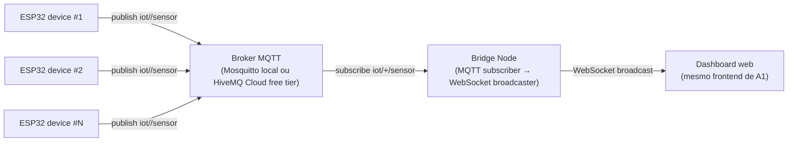

# MQTT / Pub-Sub — um dos três padrões principais do TCC

> **Status:** 100% integrado ao orquestrador (`scripts/run-experiments.mjs`).
> Pipeline completo: broker Mosquitto (Docker) + bridge Node + runner +
> dashboard. Roda tanto em modo preliminar (com `--source simulator-http`,
> usando `scripts/esp32-simulator.mjs` em `--architecture a4`) quanto em
> modo oficial (ESP32 real, **sem recompilar**: o firmware é dual-active
> com failover automático entre HTTP_BACKEND, HTTP_SERVERLESS e MQTT).
> A tag `a4` no orquestrador identifica este padrão por motivos
> históricos de numeração — **não é mais "opcional"**: faz parte do
> escopo principal junto com REST polling (`a2`) e WebSocket (`a1`).
> O serverless (`a3`) é que passa a ser tratado como subseção
> complementar, em pasta separada.

## Cenario-alvo IoT

Ingestao IoT centralizada, com um ou mais dispositivos publicando
amostras em topicos organizados por `deviceId`. O broker desacopla os
ESP32 do backend e permite consumidores adicionais (analytics, gravacao
em disco, dashboards distintos) sem que o ESP32 precise saber quantos
clientes existem -- caracteristica central do padrao Pub-Sub.



## Componentes

- **Broker**: Mosquitto via [`docker-compose.yml`](./docker-compose.yml) é o
  padrão da campanha oficial. Em ambientes sem Docker (dev/CI), a bridge
  sobe um broker `aedes` embarcado no mesmo processo quando recebe
  `MQTT_EMBEDDED_BROKER=true` — vide [bridge/README.md](./bridge/README.md).
  Endpoint configurável via `MQTT_URL`.
- **`bridge/`**: serviço Node que assina `iot/+/sensor`, reaproveita o
  pipeline de validação/processamento do backend (`SensorDataService`,
  `MetricsService`, `ExperimentService`) e expõe `SensorWebSocketServer`
  + todas as rotas REST do backend em `:4002` — inclusive `GET /config`,
  usado pelo ESP32 para sincronizar `intervalMs` mesmo quando o
  transporte ativo é MQTT.
- **Firmware ESP32**: o sketch de [embedded/esp32_sports_sensor_wifi/](../embedded/esp32_sports_sensor_wifi/)
  é **dual-active**: carrega HTTP e MQTT (`PubSubClient`) no boot e
  alterna entre `HTTP_BACKEND → HTTP_SERVERLESS → MQTT` por failover
  automático (probe a cada `FAIL_THRESHOLD` falhas consecutivas). Sem
  recompilação entre cenários. Publica JSON em `iot/{deviceId}/sensor`
  com o mesmo schema do POST HTTP — comparação justa com REST/WS — e
  `send_us` em epoch absoluto via SNTP no boot.
- **Simulador externo**: [`scripts/esp32-simulator.mjs --architecture a4`](../scripts/esp32-simulator.mjs)
  reproduz o mesmo payload e cadência do firmware publicando direto no
  broker. Usado pela campanha preliminar (`--source simulator-http`) e
  por CI.

## Métricas coletadas (mesmas dos outros padrões)

Como a bridge reusa o `SensorDataService`/`MetricsService`/`SensorWebSocketServer`
do backend Node, todas as métricas oficiais da campanha (mensagens esperadas,
recebidas, perdas, throughput, latência avg/min/max/p95, jitter, status,
distribuição HTTP) ficam disponíveis no mesmo schema. Métricas próprias
adicionais para análise específica de MQTT:

- Latência fim a fim ESP32 → bridge (publish → onMessage).
- Throughput agregado por tópico (`iot/+/sensor`).
- Backpressure do broker (`broker.queued_messages`).
- Confiabilidade por QoS (0 padrão na campanha; 1 e 2 ficam como trabalho futuro com biblioteca diferente — `PubSubClient` só implementa QoS 0).
- Custo do broker (Mosquitto self-hosted vs HiveMQ Cloud free tier) — análise qualitativa.

## Status

- [x] `bridge/index.mjs` — assinante MQTT + reúso do backend Node
      (`SensorDataService`, `SensorWebSocketServer`, todas as rotas REST
      via `createRoutes`, além de servir o mesmo dashboard estático em `:4002`).
- [x] Runner em [`scripts/lib/mqtt-runner.mjs`](../scripts/lib/mqtt-runner.mjs)
      (delegação para `runBackendCampaign` com `architecture=mqtt`).
- [x] [`docker-compose.yml`](./docker-compose.yml) para subir Mosquitto local
      + broker embarcado em Node (`aedes`) como fallback para dev/CI sem
      Docker (vide [bridge/README.md](./bridge/README.md)).
- [x] Modo `--architecture a4` no [`scripts/esp32-simulator.mjs`](../scripts/esp32-simulator.mjs)
      (publica no broker em vez de POST HTTP).
- [x] Sketch ESP32 dual-active (HTTP + MQTT no mesmo binário) com
      failover automático e polling de `GET /config` na bridge `:4002`
      para sincronizar `intervalMs` entre cenários. `PubSubClient`
      mantido em QoS 0 (vide Limitações no [README do firmware](../embedded/esp32_sports_sensor_wifi/README.md)).
- [x] Cenário `a4` totalmente integrado em
      [`scripts/run-experiments.mjs`](../scripts/run-experiments.mjs)
      (`runMqttScenario`: `startMqttBroker → startMqttBridge →
      runMqttCampaign`), incluindo na matriz oficial e na de refinement.

## Como rodar

Campanha preliminar A4 (com simulador externo, sem ESP32 real):

```powershell
node scripts/run-experiments.mjs --source simulator-http --scenarios a4 `
  --reps 1 --duration 4 --intervals 200 --results-dir resultados/smoke-mqtt --skip-analysis
```

Campanha oficial A4 (ESP32 real publicando via MQTT):

```powershell
# Pré-requisito: o ESP32 já gravado com o sketch dual-active
# (embedded/esp32_sports_sensor_wifi/) e secrets.h apontando
# MQTT_HOST + BACKEND_HTTP_BASE + MQTT_BRIDGE_HTTP_BASE para o IP LAN
# do PC. NAO eh preciso recompilar entre cenarios -- o firmware faz
# failover sozinho quando o orquestrador derruba o backend HTTP e sobe
# a bridge MQTT.
node scripts/run-experiments.mjs --scenarios a4 --reps 3
```

O orquestrador (`runMqttScenario` em `scripts/run-experiments.mjs`):

1. `startMqttBroker()` — tenta subir Mosquitto via Docker (campanha oficial).
2. Se Docker não estiver disponível, cai automaticamente para broker
   embarcado (`aedes`) na bridge — recomendado apenas para dev/CI.
3. `startMqttBridge()` sobe a bridge MQTT → WebSocket/REST em `:4002`
   (servindo o mesmo dashboard e expondo `GET /config` para o polling do firmware).
4. Em `--source simulator-http`: spawna `scripts/esp32-simulator.mjs --architecture a4`
   por intervalo. Em `--source wifi-http` (default): apenas espera o ESP32 publicar
   — o failover do firmware migra o transporte ativo para MQTT em
   300–600 ms a 100 ms de intervalo.
5. `runMqttCampaign()` coleta amostras via WebSocket da bridge e gera
   CSV/JSON com `architecture=mqtt`, `communicationMode=websocket`
   (o `websocket` aqui é apenas o canal de **observação** do orquestrador
   sobre a bridge; o transporte ESP32 → broker continua sendo MQTT puro).
