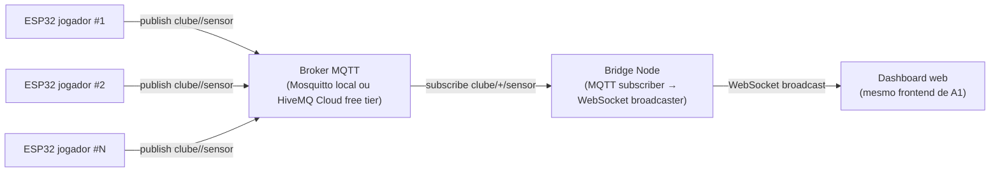

# MQTT / Pub-Sub — um dos três padrões principais do TCC

> **Status:** funcional em modo preliminar (simulador) e em modo
> oficial (ESP32 real recompilado com `#define TRANSPORT_MODE TRANSPORT_MQTT`).
> Pipeline completo: broker Mosquitto (Docker) + bridge Node + runner +
> dashboard. A tag `a4` no orquestrador identifica este padrão por
> motivos históricos de numeração — **não é mais "opcional"**: faz parte
> do escopo principal junto com REST polling (`a2`) e WebSocket (`a1`).
> O serverless (`a3`) é que passa a ser tratado como subseção
> complementar, em pasta separada.

## Cenário-alvo do clube

Treino com muitos jogadores publicando simultaneamente no centro de
treinamento (vestiário/CT). O broker desacopla os ESP32 do backend e
permite consumidores adicionais (analytics, gravação em disco,
dashboards distintos) sem que o ESP32 precise saber quantos clientes
existem — característica central do padrão Pub-Sub.



## Componentes

- **Broker** (não fornecido aqui): Mosquitto local (`docker run eclipse-mosquitto`)
  ou HiveMQ Cloud free tier. Endpoint configurável via `MQTT_URL`.
- **`bridge/`**: serviço Node que assina o tópico `clube/+/sensor`,
  reaproveita o pipeline de validação/processamento do backend
  (`SensorDataService`) e expõe o mesmo `SensorWebSocketServer` para que
  o dashboard funcione sem alterações.
- **Firmware ESP32 (modo MQTT)**: o sketch de [embedded/esp32_sports_sensor_wifi/](../embedded/esp32_sports_sensor_wifi/)
  é compilado em modo MQTT alterando `#define TRANSPORT_MODE TRANSPORT_MQTT`
  (ou via `--build-property "build.extra_flags=-DTRANSPORT_MODE=2"`).
  Ele usa a biblioteca `PubSubClient` para publicar JSON em `clube/{deviceId}/sensor`.
  Mesmo payload do modo HTTP — comparação justa com REST/WS.

## Métricas coletadas (mesmas dos outros padrões)

Como a bridge reusa o `SensorDataService`/`MetricsService`/`SensorWebSocketServer`
do backend Node, todas as métricas oficiais da campanha (mensagens esperadas,
recebidas, perdas, throughput, latência avg/min/max/p95, jitter, status,
distribuição HTTP) ficam disponíveis no mesmo schema. Métricas próprias
adicionais para análise específica de MQTT:

- Latência fim a fim ESP32 → bridge (publish → onMessage).
- Throughput agregado por tópico (`clube/+/sensor`).
- Backpressure do broker (`broker.queued_messages`).
- Confiabilidade por QoS (0 padrão na campanha; 1 e 2 ficam como trabalho futuro com biblioteca diferente — `PubSubClient` só implementa QoS 0).
- Custo do broker (Mosquitto self-hosted vs HiveMQ Cloud free tier) — análise qualitativa.

## Status

- [x] `bridge/index.mjs` — assinante MQTT + reúso do backend Node
      (`SensorDataService`, `SensorWebSocketServer`, todas as rotas REST,
      além de servir o mesmo dashboard estático em `:4002`).
- [x] Runner em [`scripts/lib/mqtt-runner.mjs`](../scripts/lib/mqtt-runner.mjs)
      (delegação para `runBackendCampaign` com `architecture=mqtt`).
- [x] [`docker-compose.yml`](./docker-compose.yml) para subir Mosquitto local
      + broker embarcado em Node (`aedes`) como fallback para dev/CI sem
      Docker (vide [bridge/README.md](./bridge/README.md)).
- [x] Modo `--architecture a4` no [`scripts/esp32-simulator.mjs`](../scripts/esp32-simulator.mjs)
      (publica no broker em vez de POST HTTP).
- [x] Sketch ESP32 em modo MQTT (`PubSubClient`, QoS 0). Selecionado em
      compile-time via `#define TRANSPORT_MODE TRANSPORT_MQTT`.

## Como rodar

Campanha preliminar A4 (com simulador externo, sem ESP32 real):

```powershell
node scripts/run-experiments.mjs --source simulator-http --scenarios a4 `
  --reps 1 --duration 4 --intervals 200 --results-dir resultados/smoke-mqtt --skip-analysis
```

Campanha oficial A4 (ESP32 real em modo MQTT):

```powershell
# 1. Recompile o sketch ESP32 com TRANSPORT_MODE=TRANSPORT_MQTT e regrave.
# 2. Garanta que MQTT_HOST no secrets.h aponta para o IP LAN do PC.
node scripts/run-experiments.mjs --scenarios a4 --reps 3
```

O orquestrador:

1. Tenta subir Mosquitto via Docker (campanha oficial).
2. Se Docker não estiver disponível, cai automaticamente para broker
   embarcado (aedes) na bridge — recomendado apenas para dev/CI.
3. Sobe a bridge MQTT → WebSocket/REST em `:4002` (servindo o mesmo dashboard).
4. Em modo `--source simulator-http`: spawna o simulador em `--architecture a4`.
   Em modo `--source wifi-http` (default): apenas espera o ESP32 publicar.
5. Coleta amostras via WebSocket da bridge e gera CSV/JSON com
   `architecture=mqtt`, `communicationMode=websocket`.
