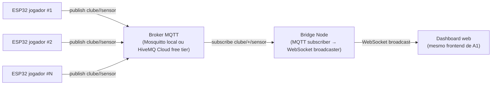

# Arquitetura A4 — Broker MQTT (opcional, destacável)

> **Status:** opcional dentro do escopo do TCC. Esta pasta inteira pode
> ser removida sem afetar A1, A2 ou A3. Os scripts da raiz só carregam
> A4 quando explicitamente acionado (ex.: `--scenarios a4`).

## Cenário-alvo do clube

Ingestão massiva intra-LAN no centro de treinamento (vestiário/CT) com
muitos jogadores publicando simultaneamente. O broker desacopla os
ESP32 do backend e permite consumidores adicionais (analytics, gravação
em disco, dashboards distintos) sem que o ESP32 saiba quantos clientes
existem.

## Componentes

- **Broker** (não fornecido aqui): Mosquitto local (`docker run eclipse-mosquitto`)
  ou HiveMQ Cloud free tier. Endpoint configurável via `MQTT_URL`.
- **`bridge/`**: serviço Node que assina o tópico `clube/+/sensor`,
  reaproveita o pipeline de validação/processamento do backend
  (`SensorDataService`) e expõe o mesmo `SensorWebSocketServer` para que
  o dashboard funcione sem alterações.
- **Firmware ESP32 (A4)**: o sketch de [embedded/esp32_sports_sensor_wifi/](../embedded/esp32_sports_sensor_wifi/)
  pode ser recompilado em modo MQTT — ainda **não implementado** no sketch
  de referência (apenas HTTP); ver "Status" abaixo.

## Métricas próprias da A4

- Latência fim a fim ESP32 → bridge (publish → onMessage).
- Throughput agregado por tópico (`clube/+/sensor`).
- Backpressure do broker (`broker.queued_messages`).
- Confiabilidade por QoS (0 vs 1) — entrega vs duplicação.
- Custo do broker (free tier vs self-hosted) — qualitativo.

## Status

- [ ] `bridge/index.ts` — assinante MQTT + bridge para o backend Node.
- [ ] Sketch ESP32 com modo MQTT (PubSubClient).
- [ ] Runner em `scripts/lib/mqtt-runner.mjs` (orquestração equivalente ao
      `backend-runner.mjs` / `serverless-runner.mjs`).
- [ ] `docker-compose.yml` opcional para subir Mosquitto local.

A entrega dessas peças está programada para uma **iteração separada**
do TCC. A pasta existe e está documentada para deixar claro como o
cenário se encaixa na análise comparativa, sem comprometer a entrega
mínima (A1 + A2 + A3).

## Como remover a A4 do escopo

1. Apagar este diretório (`arquitetura-mqtt/`).
2. Remover, em [scripts/run-experiments.mjs](../scripts/run-experiments.mjs)
   e [scripts/lib/serverless-runner.mjs](../scripts/lib/serverless-runner.mjs),
   qualquer referência a `a4` / `mqtt`. Hoje **já não há** referência
   ativa: A4 é um *placeholder*.
3. Remover do [README.md](../README.md) raiz a linha que menciona A4
   como cenário opcional, se desejado.

Nada além disso é necessário; A1, A2 e A3 são autossuficientes.
