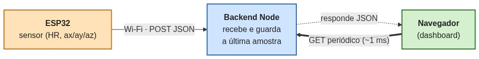
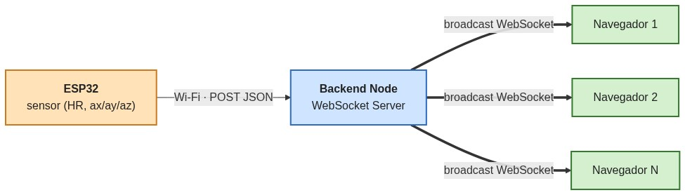
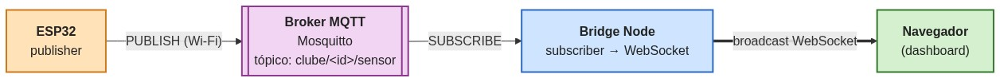
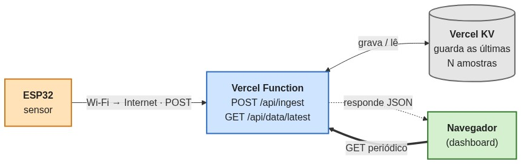
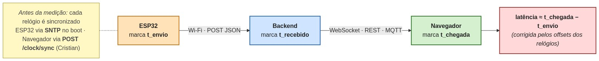
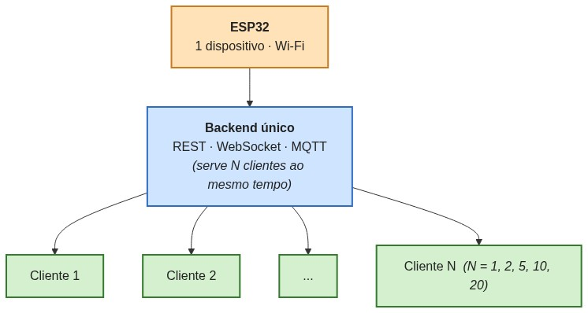
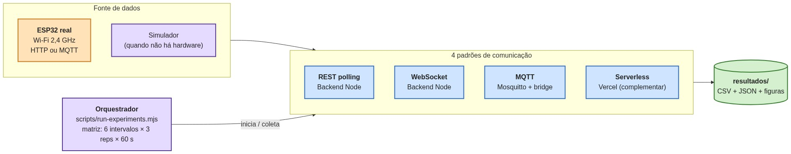
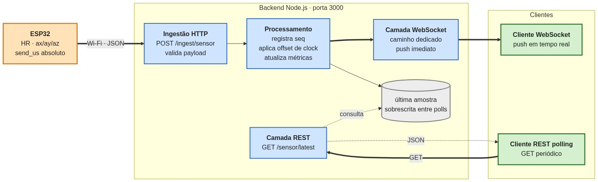
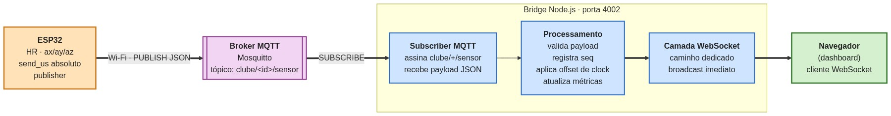

# Fluxogramas de arquitetura e fluxo

Diagramas simplificados para o TCC, alinhados à arquitetura atual (ESP32 + Wi-Fi
+ 4 padrões de comunicação). Cada diagrama foi projetado para ser entendido de
relance — poucos nós, poucas cores e rótulos curtos.

## Mapeamento

| ID | Tema | Substitui (legado) |
| --- | --- | --- |
| `A` | Arquitetura **REST polling** | `C_arquitetura_rest_polling` |
| `B` | Arquitetura **WebSocket** | `B_arquitetura_websocket` |
| `C` | Arquitetura **MQTT / Pub-Sub** | *(novo)* |
| `D` | Arquitetura **Serverless** (complementar) | *(novo)* |
| `E` | **Fluxo de medição da latência** ponta a ponta (SNTP + Cristian) | `D_fluxo_medicao_latencia` |
| `F` | **Cenário multi-cliente** (1, 2, 5, 10, 20 navegadores) | `E_cenario_multi_cliente` |
| `G` | **Ambiente experimental** completo | `F_ambiente_experimental` |
| `H` | **Fluxo de dados no backend Node.js** (ingestão única + duas vias de entrega) | *(novo, seção 3.3 do artigo)* |
| `I` | **Fluxo de dados no bridge MQTT** (subscribe + pipeline reaproveitado + WebSocket) | *(novo, seção 3.4 do artigo)* |

> Os identificadores internos `A1` (WebSocket), `A2` (REST polling),
> `A3` (Serverless) e `A4` (MQTT) ainda aparecem nos scripts da campanha
> (variáveis Python, argumentos CLI `--scenarios a1,a2,a3,a4`,
> comentários `%% ... (interno Ax)` nos `.mmd`) — eles **não** aparecem
> no artigo final nem nas figuras/tabelas geradas.

> Os diagramas antigos (Arduino Uno + USB Serial + WebSerial) ficaram preservados
> em `_legacy_resultados/figuras_tcc/diagramas/` apenas como histórico.

## Convenções visuais

Todas as figuras usam a mesma paleta para que o leitor "treine o olho" entre
elas:

- **Laranja** — dispositivo embarcado (ESP32);
- **Azul** — servidor / função / bridge;
- **Roxo** — broker MQTT (diagramas C e I);
- **Cinza** — armazenamento (diagrama D e cache da última amostra no diagrama H);
- **Verde** — cliente / dashboard / saída;
- **Lilás** — ferramenta auxiliar (orquestrador, simulador).

Setas:

- `-->` fluxo principal;
- `==>` broadcast / consulta repetida;
- `-.->` resposta / canal secundário.

## Estrutura

```
docs/diagramas/
├── mmd/                    Fontes Mermaid canônicas (.mmd)
├── svg/                    Renderizações vetoriais via mermaid.ink
├── png/                    Renderizações raster via mermaid.ink
├── _render.py              Script de renderização (mermaid.ink, best-effort)
└── README.md               Este arquivo
```

## Reproduzir as renderizações

Pré-requisito: Python 3.10+ e conexão com internet (usa o serviço público
[mermaid.ink](https://mermaid.ink)).

```powershell
python docs/diagramas/_render.py
```

Saída esperada: `SVG 9/9 | PNG 9/9`. Se não houver internet, os `.mmd`
permanecem como fonte canônica e podem ser renderizados depois.

Para editar um diagrama:

1. Altere o `.mmd` correspondente em `docs/diagramas/mmd/`.
2. Rode `python docs/diagramas/_render.py` para regenerar os PNG/SVG.
3. Confira o resultado em `docs/diagramas/png/<nome>.png`.

## Visualização rápida (preview)

| Diagrama | Preview |
| --- | --- |
| A — REST polling |  |
| B — WebSocket |  |
| C — MQTT |  |
| D — Serverless |  |
| E — Fluxo de latência |  |
| F — Multi-cliente |  |
| G — Ambiente experimental |  |
| H — Fluxo de dados no backend Node.js |  |
| I — Fluxo de dados no bridge MQTT |  |
