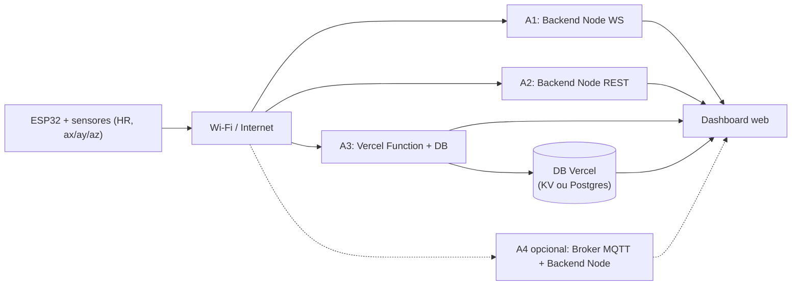

## Decisões fechadas

- Tema: "Análise de arquiteturas" como estudo de caso de um clube de futebol — qual arquitetura para qual cenário operacional.
- Matriz nova (todas alimentadas por **Wi-Fi**, ESP32 real):
  - **A1** — Backend Node + WebSocket
  - **A2** — Backend Node + REST polling
  - **A3** — Serverless (Vercel Functions) + DB
  - **A4** — Backend Node + MQTT (broker), **opcional/destacável** — todo código fica isolado para poder ser removido sem afetar A1/A2/A3
- Hardware: ESP32 real, Wi-Fi estável, campanha 100% em hardware (sem fallback simulador como dado oficial).
- WebSerial sai completamente do escopo experimental; vira "tecnologia relacionada / trabalho anterior".

## Nova arquitetura (visão geral)



## Pontos a confirmar antes de executar

1. **Banco da Vercel para A3**: Vercel KV (Redis, ideal para latência) vs Vercel Postgres / Neon (relacional, mais "real" como sistema de clube). Sugestão: começar com **Vercel KV** pelo low-latency — combinaria melhor com a comparação de latência das outras arquiteturas.
2. **Resultados antigos** em [resultados/](resultados/) (campanha USB serial): mover para `resultados/_legacy_usb_serial/` e congelar como "campanha v1 — comparativo USB", ou deletar?
3. **Matriz de intervalos**: hoje é `100, 50, 20, 10, 5, 1 ms`. Wi-Fi não sustenta 1 ms HTTP POST (≥1000 req/s por dispositivo). Sugestão da nova matriz oficial: `1000, 500, 200, 100, 50, 20 ms` (mais fiel a sensores esportivos comerciais que rodam a 50–200 Hz). Aprovar?
4. **WebSerial**: remover do disco (`prototypes/webserial`, scripts e testes) ou mover para `_legacy/` mantendo no Git?

Sigo com o plano abaixo. Esses pontos podem ser confirmados ao revisar.

## Estrutura de pastas alvo

```text
PFC-1-/
├── embedded/
│   ├── esp32_sports_sensor_wifi/        # NOVO sketch ESP32 (Wi-Fi + HTTP + SNTP)
│   │   └── esp32_sports_sensor_wifi.ino
│   └── _legacy_arduino_uno/             # Sketch antigo (USB) movido para legado
│       └── tcc_sports_sensor_standard.ino
├── arquitetura-backend-node/            # ex arquitetura-arduino-node-api/
│   └── backend/
│       ├── src/
│       │   ├── http/ingest.routes.ts    # NOVO POST /ingest/sensor (substitui serialReader)
│       │   ├── http/clock.routes.ts     # mantido
│       │   ├── services/                # mantido (sensorDataService refatorado)
│       │   └── _legacy_serial/          # SerialReader / sketches USB (deprecated)
│       └── public/                      # dashboard (apontando para A1/A2)
├── arquitetura-serverless/              # NOVO
│   ├── api/
│   │   ├── ingest.ts                    # POST /api/ingest (recebe ESP32)
│   │   ├── data/latest.ts               # GET última amostra
│   │   ├── metrics.ts                   # GET métricas agregadas
│   │   └── clock/sync.ts                # POST /clock/sync (Cristian)
│   ├── lib/                             # serializers/validators reusados
│   ├── public/                          # dashboard apontando para Vercel
│   ├── vercel.json
│   └── README.md
├── arquitetura-mqtt/                    # OPCIONAL (A4) — destacável
│   ├── broker.md                        # documentação do broker (Mosquitto/HiveMQ)
│   ├── bridge/                          # Node bridge MQTT->WebSocket
│   └── README.md
├── prototypes/_legacy_webserial/        # WebSerial movido para legado
├── scripts/
│   ├── run-experiments.mjs              # adaptado: A1/A2/A3 (+A4 opcional), sem C1
│   ├── run-multiclient-scalability.mjs  # adaptado: sem WebSerial
│   ├── lib/
│   │   ├── webserial-runner.mjs         # REMOVER
│   │   └── serverless-runner.mjs        # NOVO (deploy/health-check + observação HTTP)
│   └── tests/                           # baselines novos (httpIntake + serverless)
├── docs/
│   └── roteiro-experimentos.md          # reescrito para A1..A4 sobre Wi-Fi
└── README.md                            # tema novo "Análise de arquiteturas"
```

## Fases (executadas em ordem)

### Fase 0 — Reposicionamento do tema (apenas docs)

Atualizar narrativa do TCC ("Análise de arquiteturas para um clube de futebol") em:

- [README.md](README.md) — pergunta de pesquisa, escopo, matriz, limitações, segurança qualitativa.
- [docs/roteiro-experimentos.md](docs/roteiro-experimentos.md) — matriz, fluxo Wi-Fi, sincronização SNTP, sem WebSerial.
- [scripts/tcc_report/textos.py](scripts/tcc_report/textos.py) — todos os blocos de texto do artigo.
- [scripts/tcc_report/tabelas.py](scripts/tcc_report/tabelas.py) — descrições de arquiteturas.
- [scripts/tcc_report/diagramas_mpl.py](scripts/tcc_report/diagramas_mpl.py) e [scripts/tcc_report/mermaid.py](scripts/tcc_report/mermaid.py) — substituir desenhos USB→Node→Browser por ESP32→Wi-Fi→{Node, Serverless}.

Alinhar a comparação a **3 cenários operacionais do clube** (estudo de caso):

- Tempo real durante o jogo (latência crítica) → favorece A1 WebSocket.
- Dashboard pós-treino do staff técnico (latência tolerável) → favorece A2 REST polling.
- Ingestao IoT centralizada com multiplos dispositivos (escalabilidade global) -> favorece A3 Serverless.

### Fase 1 — Firmware ESP32 com Wi-Fi

Criar [embedded/esp32_sports_sensor_wifi/esp32_sports_sensor_wifi.ino](embedded/esp32_sports_sensor_wifi/esp32_sports_sensor_wifi.ino) baseado no sketch atual [arduino/tcc_sports_sensor_standard/tcc_sports_sensor_standard.ino](arduino/tcc_sports_sensor_standard/tcc_sports_sensor_standard.ino):

- WiFi.begin(SSID, PASS) + reconnect loop.
- SNTP via `configTime(...)` para clock absoluto (substitui o protocolo SYNC,<id> serial).
- Geração das amostras (mesmo modelo HR/ax/ay/az do sketch atual).
- `intervalMs` configurável via OTA HTTP (ex.: GET `/config` no início) ou hardcoded por compilação.
- Buffer FIFO + `WiFiClientSecure`/`HTTPClient` para POST JSON do payload sugerido pelo professor:

```json
{
  "deviceId": "esp32-01",
  "seq": 125,
  "send_us": 1710000000000000,
  "hr": 82,
  "ax": 0.12,
  "ay": -0.04,
  "az": 0.98
}
```

- Endpoint configurável por `#define` (3 builds: A1/A2 backend, A3 serverless, A4 MQTT).
- Mover sketch antigo para `embedded/_legacy_arduino_uno/`.

### Fase 2 — Adaptar backend Node (A1 + A2)

Substituir leitura serial por ingestão HTTP:

- Criar `arquitetura-backend-node/backend/src/http/ingest.routes.ts` com `POST /ingest/sensor` que aceita o JSON do ESP32 e chama o pipeline existente `SensorDataService.processSerialLine` (renomeado para `processSensorPayload`, recebendo objeto em vez de string CSV).
- Refatorar [arquitetura-arduino-node-api/backend/src/services/sensorDataService.ts](arquitetura-arduino-node-api/backend/src/services/sensorDataService.ts) para receber payload já estruturado (manter validação de ranges; remover parsing CSV — ou manter como `processSerialLine` deprecated).
- Remover/aposentar [arquitetura-arduino-node-api/backend/src/serial/serialReader.ts](arquitetura-arduino-node-api/backend/src/serial/serialReader.ts) e a dependência `serialport` em [arquitetura-arduino-node-api/backend/package.json](arquitetura-arduino-node-api/backend/package.json). Manter SerialReader em `_legacy_serial/` somente se decidirmos preservar histórico.
- Em [arquitetura-arduino-node-api/backend/src/index.ts](arquitetura-arduino-node-api/backend/src/index.ts), substituir `useSimulator/serialPort` por `httpIntake` + dashboard estático.
- Adaptar [arquitetura-arduino-node-api/backend/src/http/routes/experiments.routes.ts](arquitetura-arduino-node-api/backend/src/http/routes/experiments.routes.ts): em vez de `serialReader.synchronizeClock(...)`, usar `clock.routes.ts` Cristian/NTP via Wi-Fi + esperar primeira amostra do ESP32 com `seq=1`.
- Renomear pasta `arquitetura-arduino-node-api/` → `arquitetura-backend-node/` (atualizar todos os scripts da raiz).

```12:14:arquitetura-arduino-node-api/backend/src/index.ts
const httpServer = http.createServer(app);
const metricsService = new MetricsService();
const experimentService = new ExperimentService(metricsService);
```

### Fase 3 — Nova arquitetura serverless (A3, Vercel Functions)

Criar [arquitetura-serverless/](arquitetura-serverless/):

- `api/ingest.ts` — recebe POST do ESP32, valida, grava em Vercel KV (chave `latest:<deviceId>` + lista de últimas N amostras).
- `api/data/latest.ts` — GET para o frontend.
- `api/metrics.ts` — agrega métricas por deviceId/intervalo.
- `api/clock/sync.ts` — Cristian/NTP equivalente ao do backend.
- `api/experiments/start.ts`, `stop.ts`, `current.ts`, `export.ts` — equivalentes serverless aos do backend.
- `vercel.json` com `rewrites` e `regions` (1 região fixa para latência reprodutível).
- `public/` reusando o dashboard do backend, configurável por `BASE_URL`.
- Documentar cold start como variável experimental dedicada.

### Fase 4 — Dashboard / shared

Manter o dashboard único em [arquitetura-arduino-node-api/backend/public/](arquitetura-arduino-node-api/backend/public/) e [shared/js/](shared/js/), adicionando seletor de "alvo" (A1/A2/A3) que muda apenas a `BASE_URL`. Frontend e métricas no navegador permanecem idênticos para garantir comparabilidade.

### Fase 5 — Adaptar orquestradores

[scripts/run-experiments.mjs](scripts/run-experiments.mjs):

- Remover `--bootstrap-webserial`, `wantsC1`, `runWebserialCampaign`, importações Playwright.
- Renomear cenários para `a1` (backend WS), `a2` (backend REST), `a3` (serverless), `a4` (mqtt — opt-in).
- Antes de cada bloco: garantir ESP32 ligado e configurado para o endpoint do cenário (printar instrução e esperar `seq=1` chegar OU acionar OTA `/config?intervalMs=...&endpoint=...`).
- Sincronização: chamar `POST /clock/sync` no servidor do cenário; ESP32 já está SNTP-sincronizado; latência fim a fim = `frontend_receive_ms - send_us_convertido_para_host_ms`, com incerteza dominada por `RTT_sntp/2 + RTT_sync/2`.

[scripts/run-multiclient-scalability.mjs](scripts/run-multiclient-scalability.mjs):

- Remover bloco WebSerial (`runWebserialBlock`, `bootstrapSerialPermission`).
- Adicionar bloco serverless (`runServerlessBlock`) — N clientes consultando `/api/data/latest` ou `/api/metrics` simultaneamente.

[scripts/lib/](scripts/lib/):

- Excluir [scripts/lib/webserial-runner.mjs](scripts/lib/webserial-runner.mjs), [scripts/lib_mjs/playwright/](scripts/lib_mjs/playwright/) (não há mais Playwright na campanha oficial).
- Excluir [scripts/lib/serial-detect.mjs](scripts/lib/serial-detect.mjs) e [scripts/debug-sync.mjs](scripts/debug-sync.mjs) (sem porta serial).
- Criar `scripts/lib/serverless-runner.mjs` (deploy preview opcional, health-check, mesma observação WS/REST/HTTP do backend-runner).

### Fase 6 — Testes e baselines

- Excluir [scripts/tests/test_experiment_webserial_modules.test.mjs](scripts/tests/test_experiment_webserial_modules.test.mjs) e [scripts/tests/baselines-frontend/](scripts/tests/baselines-frontend/) específicos de WebSerial.
- Substituir [scripts/tests/test_backend_api_baseline.test.mjs](scripts/tests/test_backend_api_baseline.test.mjs) — testar `/ingest/sensor` em vez de `/data/latest` alimentado por SerialReader.
- Adicionar `scripts/tests/test_serverless_api_baseline.test.mjs` — testar contrato dos endpoints Vercel.
- Adaptar [scripts/tests/test_collection_parity.mjs](scripts/tests/test_collection_parity.mjs): congelar **novo** `schema-snapshot.json` (campos `device_id`, `wifi_rssi`, `cold_start_ms`, etc.) e marcar o snapshot antigo como `_legacy_v1.json`.
- Adaptar tests `test_experiments_modules`, `test_experiment_service_modules` para a nova superfície (sem `synchronizeClock` serial).
- Atualizar fixtures de replay: `arduino-stream-100ms.txt` → `esp32-stream-100ms.json`.

### Fase 7 — Métricas reavaliadas

Manter as atuais (`expected/received_messages`, `missing_messages`, `throughput_percent`, `estimated_latency_avg/p95_ms`, `uncertainty_*_ms`) e adicionar:

- `wifi_rssi_dbm`, `wifi_reconnects` (campo no payload do ESP32) — qualidade do canal sem fio.
- `network_jitter_ms` (desvio padrão da diferença entre intervalos consecutivos observados no servidor).
- `cold_start_ms` (apenas A3) — primeira invocação após N segundos parado, matriz dedicada de "warm-up".
- `http_status_distribution` (200/4xx/5xx) — erros de rede/serverless.
- `cost_estimate_usd` (apenas A3) — extrapolado por execução \* preço Vercel Functions.

Nova matriz oficial sugerida (sujeita a confirmação no ponto 3 acima):

| Cenário    | Intervalo                      | Duração | Reps |
| ---------- | ------------------------------ | ------- | ---- |
| A1, A2, A3 | 1000, 500, 200, 100, 50, 20 ms | 60 s    | 3    |

Matriz auxiliar de cold start (só A3): 1 amostra após 1 s, 30 s, 60 s, 5 min, 10 min de inatividade.

### Fase 8 — Análise / artigo / gráficos

- [scripts/consolidate_results.py](scripts/consolidate_results.py), [scripts/plot_results.py](scripts/plot_results.py), [scripts/plot_multiclient.py](scripts/plot_multiclient.py), [scripts/gera_figuras_tcc.py](scripts/gera_figuras_tcc.py), [scripts/generate-article-charts.py](scripts/generate-article-charts.py): adaptar para `architecture in {a1, a2, a3, a4}`, novos eixos (jitter, cold_start, RSSI).
- Reescrever [scripts/tcc_report/textos.py](scripts/tcc_report/textos.py) e [scripts/tcc_report/tabelas.py](scripts/tcc_report/tabelas.py) para o tema novo.

### Fase 9 (opcional) — A4 MQTT, isolável

Pasta `arquitetura-mqtt/` totalmente isolada — pode ser removida do plano sem afetar A1/A2/A3:

- ESP32 publica em tópico `iot/<deviceId>/sensor`.
- Broker (Mosquitto local ou HiveMQ Cloud free tier).
- Bridge Node assina o tópico, expõe WebSocket idêntico a A1 para o dashboard.
- Cenário do clube associado: ingestão massiva intra-LAN (vestiário/CT) com persistência centralizada.

## Trabalho explicitamente FORA do escopo desta migração

- Persistência longa em A1/A2 (continua em memória).
- Autenticação/TLS/secrets em produção (somente API key estática no header do ESP32 por hardening mínimo na A3).
- Frontend/dashboard novo do zero — vamos reaproveitar.
- Geração de novos resultados experimentais — esta tarefa entrega só a infra; coleta é um passo separado.

## Riscos e mitigações

- ESP32 instável em 20 ms HTTP POST sustentado → manter `1000..20` ms na matriz oficial e relegar `≤10 ms` para "trabalho futuro / hardware dedicado".
- Vercel Functions com cold start variável → matriz dedicada de cold start (Fase 7) e 1 região fixa.
- Custo na Vercel: começar no free tier; matriz oficial cabe em ~5 mil invocações/repetição → folga grande mesmo no plano gratuito.
- Resultados antigos invalidados pelo novo escopo → preservar em `resultados/_legacy_usb_serial/` para não perder histórico do trabalho.
